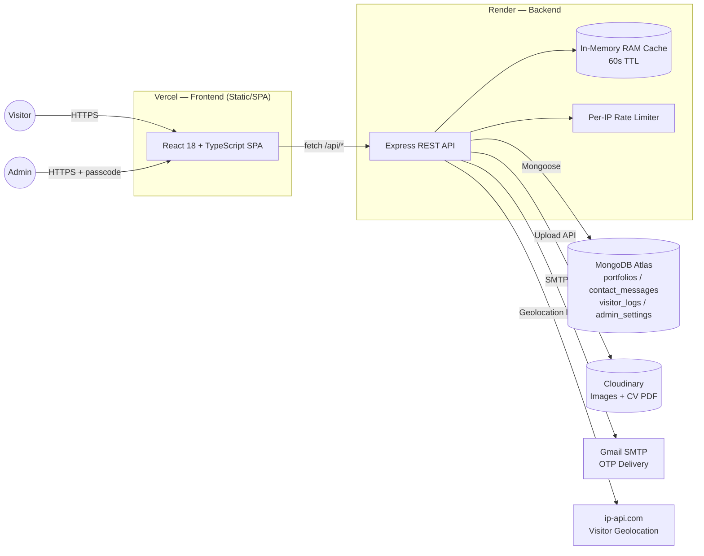
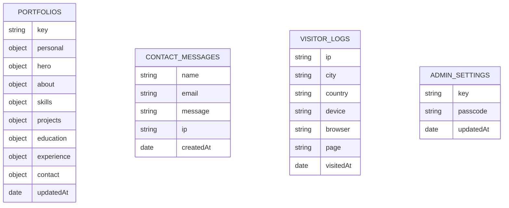

<div align="center">

# Swaraj Vecha — Portfolio & CMS

**A full-stack, database-backed developer portfolio with a live admin dashboard, Neo-Brutalist UI, and a Node/Express + MongoDB Atlas API.**

[](https://swarajvecha.in)
[](https://react.dev)
[](https://www.typescriptlang.org)
[](https://expressjs.com)
[](https://www.mongodb.com/atlas)

</div>

---

## Overview

This repository is **not a static portfolio template** — it's a two-tier application: a React 18 + TypeScript single-page app served to visitors, backed by a standalone Express API that persists all content in MongoDB Atlas and serves a **passcode + OTP-protected admin dashboard** for editing every section of the site without touching code.

Content (hero copy, skills, projects, education, certifications, contact info) lives in MongoDB rather than being hardcoded, so the site can be updated from `/admin` at any time. If the API is unreachable, the app transparently falls back to a bundled local dataset and `localStorage`, so the portfolio never shows a broken or empty page.

**Who this is for:** recruiters and hiring managers evaluating the underlying engineering (not just the visual design), and developers who want to see a realistic small-scale full-stack deployment split across Vercel (frontend) and Render (backend).

---

## ⚠️ Security Notice (read before deploying or forking)

Repository inspection found **real, working credentials committed in plaintext** in `.env.example` (Cloudinary API key/secret, an admin passcode, and a Gmail app password) and a **live MongoDB Atlas connection string with a real username/password hardcoded as a fallback** in `server/server.js`. Because this repository is public, these credentials are exposed to anyone who clones it.

**Recommended immediate action:**
1. Rotate the MongoDB Atlas user password, the Cloudinary API key/secret, the Gmail app password, and the admin passcode.
2. Remove the hardcoded MongoDB URI fallback from `server/server.js` — the app should fail loudly if `MONGODB_URI` isn't set, not fall back to a real credential in source.
3. Replace all real values in `.env.example` with placeholder text (e.g. `your_cloudinary_secret_here`).
4. Confirm `.env` is git-ignored (it is not committed today, but the example file leaking real values defeats the purpose).

This section is included in the README itself (under [Security](#security)) so it isn't missed by contributors.

---

## Key Features

### Portfolio (visitor-facing)
- Hero section with animated role/skills typing cycle
- About, Skills (grouped by category), Projects, Education, Certifications & Achievements, and Contact sections
- Neo-Brutalist visual design system (hard shadows, thick borders, bold typography) built on Tailwind CSS + Radix UI primitives (shadcn/ui)
- Scroll-triggered reveal animations, a scroll-progress bar, and a scroll-to-top control
- Client-side content protection (disables right-click and common DevTools shortcuts) with a console warning banner
- Contact form (Formspree-backed) plus a server-side `/api/contact` endpoint that stores submissions in MongoDB
- SEO: canonical URL, Open Graph + Twitter Card meta tags, and JSON-LD `Person` structured data in `index.html`

### Admin dashboard (`/admin`)
- Passcode-gated login with **brute-force protection** (3 failed attempts → 15-minute IP lockout)
- **Email-based OTP flow** to change the admin passcode (OTP sent via Nodemailer/Gmail, with a console-log fallback for local dev)
- Full CRUD editing UI for every content section (personal info, hero, about, skills, projects, education, certifications, contact) that writes directly to MongoDB Atlas
- Image and CV (PDF) uploads to Cloudinary, with a direct-storage fallback if Cloudinary isn't configured
- Built-in **visitor analytics**: IP-based geolocation, device/browser breakdown, daily visit counts (30-day rolling), and a paginated visitor log — all queryable from the dashboard
- JSON export of the full portfolio dataset

### Engineering features
- In-memory (RAM) response cache on `GET /api/portfolio` with a 60-second TTL for near-zero-latency reads, with graceful fallback to stale cache if MongoDB is temporarily unavailable
- Dependency-free, per-IP sliding-window rate limiting on all write/auth endpoints
- CORS configured for a split Vercel/Render deployment
- Vitest unit tests for the portfolio context, loading screen, and scroll components
- Playwright configured for end-to-end testing (no test specs currently written — see [Testing](#testing))

### Planned / not yet implemented
- End-to-end (Playwright) test specs
- CI/CD pipeline (no `.github/workflows` present)
- JWT/session-based admin auth (current model is a shared passcode, not per-user accounts)

---

## Technology Stack

| Category | Technology | Purpose |
|---|---|---|
| Frontend framework | React 18 + TypeScript | SPA UI, type safety |
| Build tool | Vite 5 (`@vitejs/plugin-react-swc`) | Dev server & production bundling |
| Styling | Tailwind CSS + `tailwindcss-animate` | Neo-Brutalist design system |
| UI primitives | Radix UI + shadcn/ui, `lucide-react` | Accessible unstyled components, icons |
| Routing | React Router DOM v6 | Client-side routing (`/`, `/admin`, 404) |
| Data fetching / cache | TanStack React Query | API request caching on the client |
| Forms | React Hook Form + Zod | Form state and schema validation |
| Charts | Recharts | Visitor analytics charts in `/admin` |
| Backend runtime | Node.js + Express 4 | REST API server |
| Database | MongoDB Atlas via Mongoose | Persisted portfolio content, contact messages, visitor logs, admin settings |
| Media storage | Cloudinary | Image and CV/PDF hosting |
| Email | Nodemailer (Gmail SMTP) | Admin OTP delivery |
| Analytics (client) | PostHog (`posthog-js`, `@posthog/react`) | Product/usage analytics |
| Testing | Vitest + Testing Library | Unit/component tests |
| E2E testing | Playwright | Configured, no specs yet |
| Frontend hosting | Vercel (`vercel.json`) | SPA rewrites, asset caching headers |
| Backend hosting | Render (`render.yaml`) | Web service with health check |

---

## Architecture



The frontend and backend are deployed as **two independent services**: a static Vite build on Vercel and a standalone Express process on Render, connected via `VITE_API_URL`. The frontend never talks to MongoDB or Cloudinary directly — all data access is mediated by the Express API, and the admin passcode is checked server-side on every mutating request (`requireAdmin` middleware), not just on the client.

---

## Project Structure

```text
portfolio/
├── server/
│   ├── server.js                 # Express API: portfolio CRUD, auth, uploads, contact, analytics
│   ├── upload_all_to_cloudinary.js
│   └── package.json               # Standalone server dependency manifest (used by Render)
├── src/
│   ├── components/
│   │   ├── HeroSection.tsx, AboutSection.tsx, SkillsSection.tsx,
│   │   │   ProjectsSection.tsx, EducationSection.tsx,
│   │   │   CertificationsSection.tsx, ContactSection.tsx, FooterSection.tsx
│   │   ├── Navbar.tsx, NavLink.tsx, ScrollProgressBar.tsx, ScrollToTopButton.tsx
│   │   ├── RevealOnScroll.tsx, FlipCard.tsx, PortfolioLoadingScreen.tsx
│   │   └── ui/                    # shadcn/ui + Radix-based primitives (button, dialog, table, etc.)
│   ├── pages/
│   │   ├── Index.tsx               # Public portfolio page (composes all sections)
│   │   ├── Admin.tsx               # Admin dashboard: auth, content editor, analytics
│   │   └── NotFound.tsx
│   ├── context/
│   │   └── PortfolioContext.tsx    # Fetches/syncs portfolio data with the API + localStorage fallback
│   ├── data/
│   │   └── portfolio.ts            # Default/fallback portfolio dataset (used when the API is unreachable)
│   ├── hooks/
│   │   ├── useContentProtection.ts # Disables right-click / DevTools shortcuts
│   │   ├── useScrollReveal.ts, use-mobile.tsx, use-toast.ts
│   ├── lib/
│   │   ├── api.ts                  # Resolves API base URL (Vite proxy vs. VITE_API_URL)
│   │   └── utils.ts
│   ├── test/                       # Vitest unit/component tests
│   └── App.tsx                     # Routes, providers, visitor-tracking on mount
├── public/                         # Static assets (robots.txt, OG image, placeholder)
├── vercel.json                     # Frontend deployment config (SPA rewrites, cache headers)
├── render.yaml                     # Backend deployment config (Render web service)
├── .env.example                    # Environment variable template (⚠️ see Security)
└── package.json
```

---

## Application Flow

### Portfolio content flow
```text
Visitor loads site
 ↓
PortfolioProvider fetches GET /api/portfolio
 ↓
Express checks RAM cache (60s TTL) → else queries MongoDB Atlas
 ↓
Response cached in RAM + browser localStorage
 ↓
If the request fails or times out (25s) → fall back to bundled src/data/portfolio.ts
 ↓
UI renders (Hero, About, Skills, Projects, Education, Certifications, Contact)
```

### Admin authentication & content update flow
```text
Admin visits /admin
 ↓
Enters passcode → POST /api/admin/verify (rate-limited, 3-attempt lockout)
 ↓
Passcode header (x-admin-passcode) stored in sessionStorage
 ↓
Every subsequent write (PUT /api/portfolio, uploads, analytics) sends the header
 ↓
requireAdmin middleware re-validates against the live MongoDB-stored (or .env fallback) passcode
 ↓
On success: MongoDB updated + RAM cache invalidated instantly
```

### Passcode-change flow
```text
Admin requests OTP → POST /api/admin/request-otp
 ↓
6-digit OTP emailed via Gmail SMTP (or logged to server console if SMTP isn't configured)
 ↓
Admin submits OTP + new passcode → POST /api/admin/change-passcode
 ↓
New passcode persisted to MongoDB (admin_settings collection) + RAM cache
```

---

## Screenshots

No screenshots or demo images are currently committed to the repository (`public/` contains only a favicon-style placeholder and an Open Graph card image).

`TODO: Add screenshots of the Home page, Projects section, Admin login, Admin content editor, and mobile view to a public/screenshots/ (or docs/) directory and reference them here.`

---

## Live Demo

- **Frontend:** [https://swarajvecha.in](https://swarajvecha.in) (per `index.html` canonical/OG tags; deployed via Vercel per `vercel.json`)
- **Backend API:** deployed as a Render web service per `render.yaml` (service name `swaraj-portfolio-backend`); the specific `*.onrender.com` URL is set via the frontend's `VITE_API_URL` and isn't hardcoded in the repo.

`TODO: Add the live Render backend URL here if you want it public (or leave it private and keep only the frontend URL).`

---

## Installation

### Prerequisites
- Node.js 18+ and npm
- A MongoDB Atlas cluster (or any MongoDB-compatible connection string)
- Git
- (Optional) A Cloudinary account for image/CV uploads
- (Optional) A Gmail account with an App Password for OTP email delivery

### Clone the repository
```bash
git clone https://github.com/Swarajbabu/portfolio.git
cd portfolio
```

### Install dependencies
```bash
npm install
```
The `server/` directory has its own `package.json` for Render's isolated build, but `server/server.js` is also runnable directly from the root install via `npm run server`.

### Environment variables

Copy `.env.example` to `.env` **and replace every value with your own credentials** — do not reuse the values currently committed in the example file (see [Security](#security)).

| Variable | Purpose | Required |
|---|---|---|
| `PORT` | Port the Express server listens on | No (defaults to `5000`) |
| `NODE_ENV` | `production` enables static file serving of the built SPA | No |
| `MONGODB_URI` | MongoDB Atlas connection string | Yes |
| `CLOUDINARY_CLOUD_NAME` | Cloudinary account cloud name | No (falls back to direct/base64 storage) |
| `CLOUDINARY_API_KEY` | Cloudinary API key | No |
| `CLOUDINARY_API_SECRET` | Cloudinary API secret | No |
| `ADMIN_PASSCODE` | Fallback admin passcode if none is set in MongoDB | Yes (or set one via the admin UI) |
| `EMAIL_USER` | Gmail address used to send OTP emails | No (OTP logs to console if unset) |
| `EMAIL_PASS` | Gmail App Password | No |
| `SMTP_SERVICE` | Nodemailer service name | No (defaults to `gmail`) |
| `VITE_API_URL` | Backend base URL, used by the **frontend** build | Required in production (Vercel); unused/empty for local dev via Vite proxy |

Example `.env` (placeholders only):
```env
PORT=5000
NODE_ENV=development
MONGODB_URI=mongodb+srv://<username>:<password>@<cluster>.mongodb.net/portfolio?retryWrites=true&w=majority
CLOUDINARY_CLOUD_NAME=your_cloud_name
CLOUDINARY_API_KEY=your_api_key
CLOUDINARY_API_SECRET=your_api_secret
ADMIN_PASSCODE=choose_a_strong_passcode
EMAIL_USER=your_email@gmail.com
EMAIL_PASS=your_gmail_app_password
SMTP_SERVICE=gmail
```

---

## Running the Application

### Development
```bash
# Terminal 1 — frontend (Vite dev server)
npm run dev

# Terminal 2 — backend API
npm run server
```

### Production build
```bash
npm run build      # outputs to dist/
npm run preview    # serve the production build locally
```

### Production start (backend)
```bash
npm start           # equivalent to: node server/server.js
```
When `NODE_ENV=production` and `dist/index.html` exists, the Express server serves the built SPA directly and handles client-side routing fallthrough; otherwise it serves a small JSON API status page at `/`.

### Tests
```bash
npm run lint        # ESLint
npm run typecheck   # tsc --noEmit
npm test            # Vitest unit tests
npm run test:e2e    # Playwright (no specs currently defined)
```

---

## API Documentation

All endpoints are prefixed with `/api`. Admin-only endpoints require an `x-admin-passcode` header matching the active passcode.

| Method | Endpoint | Description | Auth |
|---|---|---|---|
| GET | `/api/portfolio` | Fetch full portfolio content (RAM-cached, 60s TTL) | Public |
| PUT | `/api/portfolio` | Replace the portfolio document | Admin |
| POST | `/api/upload` | Upload a base64 image (≤~5MB) to Cloudinary or store directly | Admin |
| POST | `/api/upload-cv` | Upload a base64 PDF CV (≤~10MB) to Cloudinary | Admin |
| POST | `/api/contact` | Submit a contact form message | Public (rate-limited) |
| GET | `/api/contact/messages` | List the 50 most recent contact messages | Admin |
| POST | `/api/admin/verify` | Verify the admin passcode (3-attempt lockout, 15 min) | Public (rate-limited) |
| POST | `/api/admin/request-otp` | Send a 6-digit OTP to the admin email | Public (rate-limited) |
| POST | `/api/admin/change-passcode` | Verify OTP and set a new admin passcode | Public (OTP-gated, rate-limited) |
| POST | `/api/track-visit` | Log a visitor (IP-based geolocation, device/browser) | Public (rate-limited) |
| GET | `/api/analytics/visitors` | Aggregated visitor analytics (totals, daily counts, top locations, device breakdown, paginated log) | Admin |
| DELETE | `/api/analytics/visitors/:id` | Delete a single visitor log entry | Admin |
| DELETE | `/api/analytics/visitors` | Clear all visitor logs | Admin |
| GET | `/api/health` | Health check (Mongo connection state, Cloudinary config presence) | Public |

---

## Database

**Technology:** MongoDB Atlas, accessed via Mongoose (connection) and the native driver (collection queries).

| Collection | Purpose |
|---|---|
| `portfolios` | Single document (`key: "main_portfolio"`) holding the entire portfolio content tree |
| `contact_messages` | Contact form submissions (name, email, message, IP, user agent, timestamp) |
| `visitor_logs` | Per-visit records (IP, geolocation, device, browser, referrer, page, timestamp) used for analytics |
| `admin_settings` | Single document (`key: "admin_auth"`) storing the current admin passcode |

There is no formal Mongoose schema layer — documents are read/written as plain objects via `mongoose.connection.db.collection(...)`, so validation happens at the API layer (Express route handlers) rather than the database layer.



---

## Authentication & Authorization

- **Model:** a single shared admin passcode (not per-user accounts or JWT sessions). The passcode lives in MongoDB (`admin_settings`) with an environment-variable fallback, and is cached in memory for 30 seconds to avoid a DB round-trip on every request.
- **Login:** `POST /api/admin/verify` checks the supplied passcode server-side; the client stores it in `sessionStorage` (not `localStorage`) and re-sends it as the `x-admin-passcode` header on every admin request.
- **Brute-force protection:** 3 failed attempts from an IP trigger a 15-minute lockout, tracked in an in-memory map.
- **Passcode rotation:** requires a 6-digit OTP emailed to the configured admin address before a new passcode can be set — a meaningful control against someone who guesses or leaks the current passcode.
- **Authorization:** the `requireAdmin` Express middleware gates every mutating and analytics-reading route.
- **Logout:** implemented client-side by clearing the `sessionStorage` entry (ends when the browser tab/session closes).

---

## Security

| Area | Status |
|---|---|
| Password/passcode hashing | ❌ Missing — the admin passcode is stored and compared in plaintext |
| Brute-force protection | ✅ Implemented (3-attempt lockout per IP, 15 min) |
| Rate limiting | ✅ Implemented (dependency-free, per-IP, per-endpoint) |
| CORS | ⚠️ Partial — currently allows any origin (`callback(null, true)`), which is broad for a credentialed API |
| Input validation | ⚠️ Partial — contact form validates format/length; portfolio `PUT` only checks the body is an object |
| Error handling | ✅ Implemented — `sendServerError` hides internal error details in production |
| Secrets management | ❌ **Not implemented** — real credentials are committed in `.env.example` and hardcoded as a MongoDB URI fallback in `server/server.js` (see [Security Notice](#️-security-notice-read-before-deploying-or-forking) above) |
| HTTP security headers (CSP, HSTS, etc.) | ❌ Missing — no `helmet` or equivalent middleware |
| XSS protection | ⚠️ Partial — React escapes rendered content by default; no explicit sanitization layer for admin-entered content |
| NoSQL injection prevention | ⚠️ Partial — Mongoose/native driver parameterization protects most queries, but the `PUT /api/portfolio` body is written with minimal shape validation |
| Client-side "content protection" | ⚠️ Cosmetic only — disabling right-click/DevTools shortcuts (`useContentProtection`) does not prevent inspection of client-served code or network requests |

---

## Performance

**Implemented:**
- In-memory RAM cache on the hot-path `GET /api/portfolio` (60s TTL, 0ms serve time on hit) with stale-cache fallback if MongoDB is slow/unreachable
- `Cache-Control` headers on the portfolio API response and on static assets (`vercel.json`, 1-year immutable cache on `/assets`)
- Code-splitting via `React.lazy` for the Admin and NotFound routes
- MongoDB connection pooling (`maxPoolSize: 10`, `minPoolSize: 2`)

**Recommended improvements:**
- Add response compression (`compression` middleware) on the Express server
- Lazy-load below-the-fold sections/images on the public site
- Add database indexes on `visitor_logs.visitedAt` and `contact_messages.createdAt` for the analytics aggregation queries

---

## SEO & Accessibility

**Implemented:** canonical URL, meta description/title, Open Graph tags, Twitter Card tags, and JSON-LD `Person` structured data (all in `index.html`); a `robots.txt` allowing all crawlers.

**Recommended improvements:**
- Add a `sitemap.xml`
- Audit heading hierarchy and ARIA attributes across custom components (the Radix/shadcn `ui/` primitives are accessible by default, but the hand-built sections haven't been explicitly audited)
- Add `alt` text coverage checks for all portfolio/project images (currently sourced dynamically from MongoDB/Cloudinary, so alt text quality depends on admin-entered data)

---

## Testing

**Implemented:** Vitest + React Testing Library unit/component tests covering `PortfolioContext`, the loading screen, and scroll-related components (`src/test/`).

**Not implemented:** Playwright is configured (`playwright.config.ts`, `playwright-fixture.ts`) but no `.spec.ts` test files currently exist, so `npm run test:e2e` has nothing to run yet. There is no backend (API route) test suite.

### Recommended testing strategy
1. Add Playwright specs for the critical user paths: viewing the portfolio, submitting the contact form, and the admin login → edit → save flow.
2. Add integration tests for `server/server.js` routes (e.g. with `supertest`) covering auth, rate limiting, and the portfolio CRUD endpoints.
3. Wire `npm test`, `npm run test:e2e`, and `npm run lint` into CI (see below).

---

## CI/CD

No `.github/workflows` directory exists in this repository — there is currently no automated pipeline.

### Recommended CI/CD
```text
Push / PR
 ↓
Lint (eslint) + Typecheck (tsc)
 ↓
Unit tests (vitest)
 ↓
Build (vite build)
 ↓
E2E tests (playwright, once specs exist)
 ↓
Deploy — Vercel (frontend) / Render (backend) via their native Git integrations
```
This is a recommendation, not a currently implemented pipeline.

---

## Deployment

- **Frontend:** Vercel, configured via `vercel.json` — Vite build, output to `dist/`, SPA rewrite (`/(.*) → /index.html`), 1-year immutable caching on `/assets`.
- **Backend:** Render, configured via `render.yaml` — Node web service (`swaraj-portfolio-backend`), build command `npm install`, start command `node server/server.js`, health check at `/api/health`. Secrets (`MONGODB_URI`, Cloudinary keys, `ADMIN_PASSCODE`, email credentials) are marked `sync: false`, meaning they must be set manually in the Render dashboard rather than committed.
- **Database:** MongoDB Atlas (external, not part of this repo's deployment config).
- **Frontend ↔ backend linkage:** the Vercel deployment must set `VITE_API_URL` to the live Render backend URL at build time.

### Production deployment recommendations
- Rotate and securely store all secrets outside of git (see [Security Notice](#️-security-notice-read-before-deploying-or-forking))
- Add uptime monitoring against `/api/health`
- Add structured logging / error tracking (e.g. Sentry) instead of `console.error` for production visibility
- Tighten CORS to the known frontend origin(s) instead of allowing all origins
- Add automated MongoDB Atlas backups (Atlas supports this natively — confirm it's enabled on the cluster)

---

## Production Readiness

| Area | Status |
|---|---|
| Core CRUD / portfolio API | ✅ |
| Admin authentication | ⚠️ (passcode-based, no hashing — see Security) |
| Input validation | ⚠️ |
| Error handling | ✅ |
| Rate limiting | ✅ |
| Secrets management | ❌ |
| Testing (unit) | ⚠️ (present, partial coverage) |
| Testing (E2E) | ❌ (configured, not written) |
| CI/CD | ❌ |
| Monitoring / logging | ❌ |
| SEO | ✅ |
| Documentation | ✅ (this README) |

---

## Engineering Decisions

- **React + Vite over a meta-framework (Next.js, etc.):** the site is a client-rendered SPA with no server-rendering requirement, so Vite keeps the build simple and fast while React Router handles the two real routes (`/` and `/admin`).
- **Two independently deployed services (Vercel + Render) instead of one monolith:** decouples static asset delivery (best served by a CDN/edge network like Vercel) from a long-running Node process that needs a persistent MongoDB connection (better suited to Render).
- **MongoDB over a relational database:** the portfolio content is a single, deeply nested, evolving document (sections, arrays of projects/skills/certifications) that maps naturally onto a document store rather than a normalized relational schema.
- **RAM caching layer in front of MongoDB:** since the portfolio content changes rarely (only via the admin dashboard) but is read on every visitor page load, a short-TTL in-memory cache trades a small staleness window for near-zero read latency without adding external caching infrastructure (e.g. Redis).
- **shadcn/ui + Radix over a full component library:** gives accessible, unstyled primitives that can be fully re-skinned for the custom Neo-Brutalist design system, rather than fighting a themed library's defaults.

---

## Challenges & Solutions

### Challenge: Keeping the site fast while content lives in a remote database
**Solution:** a 60-second in-memory cache on the read-heavy `GET /api/portfolio` endpoint, plus a client-side fallback chain (MongoDB → stale RAM cache → bundled local dataset → `localStorage`).
**Result:** visitors get near-instant page loads, and the site degrades gracefully instead of breaking if MongoDB or the API is briefly unavailable.

### Challenge: Protecting a single-passcode admin panel without a full user/auth system
**Solution:** layered protections around the shared passcode — per-IP rate limiting, a 3-attempt/15-minute lockout, and an email-OTP requirement to change the passcode itself.
**Result:** meaningfully raises the cost of brute-forcing or casually guessing the passcode, without the overhead of a full accounts system for a single-admin site.

### Challenge: Split frontend/backend deployment across two different platforms
**Solution:** an explicit `getApiUrl()` helper (`src/lib/api.ts`) that resolves the backend base URL from `VITE_API_URL` at build time, keeping the frontend platform-agnostic about where the API actually lives.
**Result:** the same frontend build works against local dev (Vite proxy / relative paths) or the live Render backend without code changes.

---

## Future Roadmap

### Phase 1 — Code Quality & Security
- Rotate and remove all committed secrets; enforce validation server-side (schema validation on `PUT /api/portfolio`)
- Hash the admin passcode instead of storing/comparing it in plaintext
- Add `helmet` for standard HTTP security headers; restrict CORS to known origins

### Phase 2 — Testing & CI/CD
- Write Playwright E2E specs for the core flows
- Add backend integration tests
- Stand up a GitHub Actions pipeline (lint → typecheck → test → build)

### Phase 3 — Performance & Observability
- Add response compression and database indexes on analytics-heavy collections
- Add error tracking/monitoring (e.g. Sentry) and uptime checks against `/api/health`

### Phase 4 — Product
- Multi-admin accounts with individual credentials instead of a shared passcode
- Sitemap + expanded structured data
- Screenshot/demo gallery in the README and site

---

## Contributing

1. Fork the repository
2. Clone your fork
   ```bash
   git clone https://github.com/<your-username>/portfolio.git
   cd portfolio
   ```
3. Create a feature branch
   ```bash
   git checkout -b feature/your-feature
   ```
4. Make your changes
5. Run checks
   ```bash
   npm run lint
   npm run typecheck
   npm test
   ```
6. Commit using conventional commits
   ```bash
   git add .
   git commit -m "feat: add ..."
   ```
7. Push and open a pull request
   ```bash
   git push origin feature/your-feature
   ```

---

## License

No `LICENSE` file is currently present in this repository, even though the previous README stated "MIT". `TODO: Add an MIT LICENSE file (or another license of your choosing) if you intend this project to be open-source and reusable — otherwise remove license claims from the README.`

---

## Author

**Swaraj Vecha** — AI/ML & Full Stack Engineer, B.Tech CSE @ Lovely Professional University

- Portfolio: [swarajvecha.in](https://swarajvecha.in)
- GitHub: [@Swarajbabu](https://github.com/Swarajbabu)
- LinkedIn: [linkedin.com/in/laxmiswarajbabu](https://www.linkedin.com/in/laxmiswarajbabu)
- LeetCode: [leetcode.com/u/swarajvecha](https://leetcode.com/u/swarajvecha/)